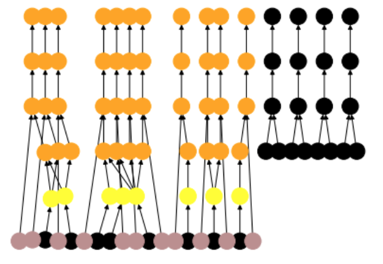

Experiment Planning
===================

Trident provides a class to help with creating Aquarium plans, called the "planner"

Features: topological sorting, plan optimizer, drawing

You can draw existing plans (colors represent Operation statuses, legend to come...):

.. code::

    %matplotlib inline

    from pydent import planner
    canvas = planner.Planner(mysession, plan_id=12345)
    canvas.layout.draw()

In Aquarium, this plan will look like:

.. image:: _static/AquariumPlanExample1.png
    :width: 50 %
    :align: left

Example of planning a large PCR in a IPython jupyter notebook.

.. code::

    %matplotlib inline
    from pydent import planner
    from mysession import production

    sample_range = list(range(25589, 25604))
    canvas = planner.Planner(production)

    def set_primer(canvas, field_value, sample):
        canvas.set_field_value(field_value, sample=sample)
        items = [item for item in sample.items if item.location != 'deleted']
        primer_stocks = [item for item in items if item.object_type.name == "Primer Stock"]
        primer_aliquots = [item for item in items if item.object_type.name == "Primer Aliquot"]

        if len(primer_aliquots) > 0:
            # set item
            canvas.set_field_value(field_value, sample=sample, item=primer_aliquots[-1])
            return
        else:
            print("No primer aliquots found for {}".format(sample.name))
            if len(primer_stocks) > 0:
                # create Make Primer Aliquot from Stock
                op = canvas.create_operation_by_name("Make Primer Aliquot from Stock")
                canvas.add_wire(op.outputs[0], field_value)
                canvas.set_field_value(ops[0].inputs[0], sample=sample, item=primer_stocks[-1])
                return
            else:
                print("No primer stocks found for {}".format(sample.name))
                # create Order Primer and Rehydrate Primer
                op = canvas.create_operation_by_name("Order Primer")

                canvas.set_field_value(op.inputs[0], value="yes")
                canvas.set_field_value(op.outputs[0], sample=field_value.sample)
                ops = canvas.quick_create_chain(op, "Rehydrate Primer")
                canvas.add_wire(ops[1].outputs[0], field_value)
                return

    def submit_pcr(canvas, sample):
        op = canvas.create_operation_by_name("Make PCR Fragment")
        canvas.set_field_value(op.outputs[0], sample=sample)

        fwd = sample.properties['Forward Primer']
        rev = sample.properties['Reverse Primer']
        template = sample.properties['Template']

        set_primer(canvas, op.input("Forward Primer"), fwd)
        set_primer(canvas, op.input("Reverse Primer"), rev)

        canvas.set_field_value(op.input("Template"), sample=template)

        new_ops = canvas.quick_create_chain(op, "Run Gel", "Extract Gel Slice", "Purify Gel Slice")
        run_gel = new_ops[1]
        canvas.quick_create_chain("Pour Gel", run_gel)

    from pydent.utils import make_async

    @make_async(chunk_size=1, progress_bar=False)
    def submit_pcrs(sample_range):
        for sample_id in sample_range:
            submit_pcr(canvas, production.Sample.find(sample_id))
        return []

    # submit PCR asynchrounous to the canvas
    submit_pcrs(sample_range)

    # optimize the plan
    canvas.optimize()

    # topologically sort the layout
    canvas.layout.topo_sort()

    # draw the layout
    canvas.layout.draw()

    # push the plan to Aquarium
    canvas.create()

    # display the Aquarium plan url
    canvas.url